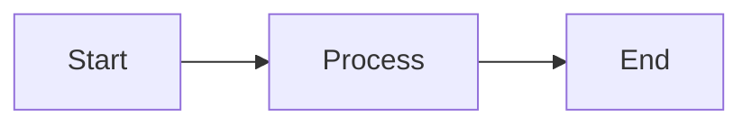

# VS Code Best Practices for Documentation

## Overview

This guide covers best practices for using Visual Studio Code to create, manage, and maintain project documentation efficiently.

## Table of Contents

- [Initial Setup](#initial-setup)
- [Essential Extensions](#essential-extensions)
- [Workspace Configuration](#workspace-configuration)
- [Markdown Writing](#markdown-writing)
- [File Organization](#file-organization)
- [Version Control Integration](#version-control-integration)
- [Productivity Tips](#productivity-tips)
- [Collaboration](#collaboration)

---

## Initial Setup

### Installing VS Code

1. Download from [code.visualstudio.com](https://code.visualstudio.com/)
2. Choose the appropriate installer for your OS (Windows, macOS, Linux)
3. Follow the installation wizard
4. Launch VS Code

### First-Time Configuration

**Enable Settings Sync** (recommended):
1. Press `Ctrl+Shift+P` (or `Cmd+Shift+P` on macOS)
2. Type "Settings Sync: Turn On"
3. Sign in with GitHub or Microsoft account
4. Your settings, extensions, and keybindings sync across devices

**Configure Auto Save**:
```json
// Settings: File > Preferences > Settings (or Ctrl+,)
{
  "files.autoSave": "afterDelay",
  "files.autoSaveDelay": 1000
}
```

---

## Essential Extensions

### Must-Have Extensions for Documentation

#### 1. Markdown All in One
**ID**: `yzhang.markdown-all-in-one`

**Features**:
- Keyboard shortcuts for formatting
- Auto-completion for lists
- Table of contents generation
- Auto-preview scrolling sync

**Installation**:
```
Ctrl+Shift+X → Search "Markdown All in One" → Install
```

#### 2. markdownlint
**ID**: `DavidAnson.vscode-markdownlint`

**Features**:
- Real-time Markdown linting
- Style consistency checking
- Automatic fixes for common issues

**Recommended Settings**:
```json
{
  "markdownlint.config": {
    "MD013": false,  // Disable line length rule
    "MD033": false   // Allow inline HTML
  }
}
```

#### 3. Markdown Preview Enhanced
**ID**: `shd101wyy.markdown-preview-enhanced`

**Features**:
- Advanced preview with diagrams
- Export to PDF, HTML, PNG
- Support for Mermaid diagrams
- Math equation rendering

**Usage**:
- Right-click Markdown file → "Markdown Preview Enhanced: Open Preview"
- Or press `Ctrl+K V`

#### 4. Code Spell Checker
**ID**: `streetsidesoftware.code-spell-checker`

**Features**:
- Spell checking in Markdown and code comments
- Custom dictionaries
- Multiple language support

**Configuration**:
```json
{
  "cSpell.enabled": true,
  "cSpell.language": "en",
  "cSpell.userWords": [
    "VSCode",
    "GitHub",
    "API"
  ]
}
```

#### 5. Prettier - Code Formatter
**ID**: `esbenp.prettier-vscode`

**Features**:
- Consistent Markdown formatting
- Format on save
- Configurable style

**Configuration**:
```json
{
  "editor.formatOnSave": true,
  "editor.defaultFormatter": "esbenp.prettier-vscode",
  "[markdown]": {
    "editor.formatOnSave": true
  }
}
```

#### 6. GitLens
**ID**: `eamodio.gitlens`

**Features**:
- See who changed documentation and when
- Inline blame annotations
- File history visualization
- Compare versions

### Optional but Useful Extensions

- **Paste Image** (`mushan.vscode-paste-image`): Paste screenshots directly into Markdown
- **Draw.io Integration** (`hediet.vscode-drawio`): Create diagrams in VS Code
- **Grammarly** (`znck.grammarly`): Advanced grammar checking
- **Word Count** (`ms-vscode.wordcount`): Track document length
- **Path Intellisense** (`christian-kohler.path-intellisense`): Auto-complete file paths

---

## Workspace Configuration

### Creating a Documentation Workspace

**Step 1**: Open your documentation folder
```
File → Open Folder → Select your documentation directory
```

**Step 2**: Save as workspace
```
File → Save Workspace As... → documentation.code-workspace
```

**Step 3**: Configure workspace settings

Create `.vscode/settings.json` in your documentation folder:

```json
{
  // Editor
  "editor.wordWrap": "on",
  "editor.formatOnSave": true,
  "editor.rulers": [80, 120],

  // Files
  "files.autoSave": "afterDelay",
  "files.exclude": {
    "**/.git": true,
    "**/node_modules": true,
    "**/.DS_Store": true
  },

  // Markdown
  "[markdown]": {
    "editor.defaultFormatter": "esbenp.prettier-vscode",
    "editor.formatOnSave": true,
    "editor.wordWrap": "on",
    "editor.quickSuggestions": {
      "comments": "on",
      "strings": "on",
      "other": "on"
    }
  },

  // Spell Checker
  "cSpell.enabled": true,
  "cSpell.words": [
    // Add project-specific terms
  ],

  // Markdown Linting
  "markdownlint.config": {
    "MD013": false,
    "MD033": false,
    "MD041": false
  }
}
```

### Project-Specific Snippets

Create `.vscode/markdown.code-snippets`:

```json
{
  "Insert Code Block": {
    "prefix": "codeblock",
    "body": [
      "```$1",
      "$2",
      "```"
    ],
    "description": "Insert a code block"
  },

  "Insert Note": {
    "prefix": "note",
    "body": [
      "> **Note**: $1"
    ],
    "description": "Insert a note callout"
  },

  "Insert Warning": {
    "prefix": "warning",
    "body": [
      "> **Warning**: $1"
    ],
    "description": "Insert a warning callout"
  },

  "Insert Table": {
    "prefix": "table",
    "body": [
      "| ${1:Header1} | ${2:Header2} | ${3:Header3} |",
      "|--------------|--------------|--------------|",
      "| ${4:Cell1}   | ${5:Cell2}   | ${6:Cell3}   |"
    ],
    "description": "Insert a table"
  }
}
```

---

## Markdown Writing

### Keyboard Shortcuts

#### Built-in Shortcuts

| Action | Windows/Linux | macOS |
|--------|---------------|-------|
| **Bold** | `Ctrl+B` | `Cmd+B` |
| **Italic** | `Ctrl+I` | `Cmd+I` |
| Toggle Preview | `Ctrl+Shift+V` | `Cmd+Shift+V` |
| Open Preview Side-by-Side | `Ctrl+K V` | `Cmd+K V` |
| Find | `Ctrl+F` | `Cmd+F` |
| Replace | `Ctrl+H` | `Cmd+H` |
| Go to Line | `Ctrl+G` | `Cmd+G` |

#### Markdown All in One Shortcuts

| Action | Shortcut |
|--------|----------|
| Toggle bullet list | `Ctrl+Shift+]` |
| Toggle numbered list | `Ctrl+Shift+[` |
| Toggle checkbox | `Ctrl+Shift+C` |
| Create Table of Contents | `Ctrl+Shift+P` → "Create Table of Contents" |

### Live Preview

**Enable side-by-side editing and preview**:

1. Open a Markdown file
2. Press `Ctrl+K V` (or `Cmd+K V` on macOS)
3. Edit on the left, see preview on the right
4. Preview scrolls automatically with your cursor

**Preview with Markdown Preview Enhanced**:
- More features (diagrams, export, themes)
- Right-click file → "Markdown Preview Enhanced: Open Preview"

### Formatting Best Practices

#### Headings

```markdown
# H1 - Main Title (One per document)
## H2 - Major Sections
### H3 - Subsections
#### H4 - Details
```

**Best Practice**: Use heading hierarchy properly (don't skip levels)

#### Lists

**Unordered Lists**:
```markdown
- Item 1
- Item 2
  - Nested item
  - Another nested item
- Item 3
```

**Ordered Lists**:
```markdown
1. First item
2. Second item
3. Third item
```

**Task Lists**:
```markdown
- [x] Completed task
- [ ] Incomplete task
- [ ] Another task
```

#### Links

**Inline Links**:
```markdown
[Link Text](https://example.com)
```

**Reference Links** (better for long documents):
```markdown
See the [documentation][docs] for details.

[docs]: https://example.com/docs
```

**Internal Links**:
```markdown
See [Installation Section](#installation)
```

#### Code Blocks

**Inline Code**:
```markdown
Use the `npm install` command
```

**Code Blocks**:
````markdown
```javascript
const example = "Hello World";
console.log(example);
```
````

**With Line Numbers** (in Markdown Preview Enhanced):
````markdown
```javascript {.line-numbers}
const example = "Hello World";
console.log(example);
```
````

#### Images

```markdown

*Caption for the image*
```

**With Width Control** (HTML):
```html

```

#### Tables

```markdown
| Column 1 | Column 2 | Column 3 |
|----------|----------|----------|
| Data 1   | Data 2   | Data 3   |
| Data 4   | Data 5   | Data 6   |
```

**Alignment**:
```markdown
| Left | Center | Right |
|:-----|:------:|------:|
| L1   | C1     | R1    |
```

---

## File Organization

### Recommended Folder Structure

```
documentation/
├── README.md                 # Entry point
├── .vscode/
│   ├── settings.json        # Project settings
│   └── markdown.code-snippets
├── docs/
│   ├── getting-started.md
│   ├── api-reference.md
│   └── guides/
│       ├── installation.md
│       └── configuration.md
├── images/
│   ├── screenshots/
│   └── diagrams/
└── templates/
    └── template.md
```

### File Naming Conventions

**Best Practices**:
- Use lowercase with hyphens: `getting-started.md`
- Be descriptive: `user-authentication-guide.md`
- Avoid spaces: ❌ `User Guide.md` → ✅ `user-guide.md`
- Use consistent naming across project

### Using the Explorer

**Keyboard Shortcuts**:
- `Ctrl+Shift+E`: Toggle Explorer view
- `Ctrl+P`: Quick file open (type filename)
- `Ctrl+Shift+F`: Search across all files

**Tips**:
- Star important files: Right-click → "Add to Favorites"
- Use breadcrumbs for navigation (top of editor)
- Multi-select files: `Ctrl+Click` multiple files

---

## Version Control Integration

### Git Integration in VS Code

#### Source Control Panel

**Access**: `Ctrl+Shift+G`

**Features**:
- See changed files
- Stage/unstage changes
- Commit with messages
- View diff inline
- Push/pull from remote

#### Committing Changes

**Workflow**:

1. **View Changes**:
   ```
   Ctrl+Shift+G → See modified files
   ```

2. **Review Diff**:
   - Click on changed file to see inline diff
   - Green: additions, Red: deletions

3. **Stage Changes**:
   - Click `+` next to file to stage
   - Or stage all: Click `+` next to "Changes"

4. **Write Commit Message**:
   ```
   Type message in text box at top:

   docs: update installation guide

   - Added prerequisites section
   - Updated command examples
   - Fixed typos in configuration
   ```

5. **Commit**:
   - Click ✓ checkmark or press `Ctrl+Enter`

#### GitLens Features

**Inline Blame**:
- See who last modified each line
- View commit message on hover
- Click to see full commit details

**File History**:
- Right-click file → "Open File History"
- See all changes over time
- Compare any two versions

**Useful Commands** (`Ctrl+Shift+P`):
- "GitLens: Show File History"
- "GitLens: Compare File with Previous Revision"
- "Git: View File History"

### Best Practices for Documentation Commits

**Commit Message Format**:
```
docs: brief description (50 chars max)

- Detailed point 1
- Detailed point 2
- Fixed issue #123
```

**Common Prefixes**:
- `docs: ` - Documentation changes
- `fix: ` - Fixing documentation errors
- `update: ` - Updating existing content
- `add: ` - Adding new documentation
- `remove: ` - Removing outdated docs

---

## Productivity Tips

### Multi-Cursor Editing

**Select Multiple Occurrences**:
1. Place cursor on word
2. `Ctrl+D` to select next occurrence
3. Repeat to select more
4. Edit all at once

**Column Selection**:
- `Alt+Shift+Drag` to select columns
- Useful for formatting lists/tables

### Find and Replace

**Basic Find**: `Ctrl+F`

**Find and Replace**: `Ctrl+H`

**Find in Files**: `Ctrl+Shift+F`
- Search across entire project
- Use regex for advanced patterns
- Filter by file type

**Regex Examples**:
- Find broken links: `\[.*\]\(\)`
- Find TODOs: `TODO:.*`
- Find headings: `^#{1,6}\s.*`

### Snippets

**Use Built-in Snippets**:
- Type prefix and press `Tab`
- Example: Type `link` → Tab → Creates link template

**Create Custom Snippets**:
1. `Ctrl+Shift+P` → "Preferences: Configure User Snippets"
2. Choose "markdown.json"
3. Add your snippets (see Workspace Configuration section)

### Command Palette

**Access**: `Ctrl+Shift+P`

**Useful Commands**:
- "Markdown: Open Preview"
- "Markdown All in One: Create Table of Contents"
- "Transform to Title Case"
- "Sort Lines Ascending"
- "Format Document"

### Zen Mode

**Focus on Writing**:
- Press `Ctrl+K Z` to enter Zen Mode
- Distraction-free writing environment
- Press `Esc` twice to exit

---

## Collaboration

### Live Share

**Install Extension**: `MS-vsliveshare.vsliveshare`

**Features**:
- Real-time collaborative editing
- Share terminal, servers, debugging
- Perfect for pair documentation writing

**Usage**:
1. Click "Live Share" in status bar
2. Share link with collaborator
3. Edit together in real-time

### Code Review in VS Code

**Review Documentation Changes**:

1. **Install GitHub Pull Requests Extension**:
   - ID: `GitHub.vscode-pull-request-github`

2. **Review PRs in VS Code**:
   - See all open PRs in sidebar
   - View diff inline
   - Comment on specific lines
   - Approve or request changes

### Comments and Annotations

**TODO Comments**:
```markdown
<!-- TODO: Add more examples here -->
<!-- FIXME: Broken link needs updating -->
<!-- NOTE: This section needs review -->
```

**Track TODOs**:
- Install "Todo Tree" extension
- View all TODOs in sidebar
- Filter by type (TODO, FIXME, NOTE)

---

## Advanced Features

### Diagrams in Markdown

**Mermaid Diagrams** (with Markdown Preview Enhanced):

````markdown

````

**Draw.io Integration**:
1. Install Draw.io Integration extension
2. Create `.drawio.svg` files
3. Edit diagrams directly in VS Code
4. Embed in Markdown

### Export Documentation

**With Markdown Preview Enhanced**:

1. Open preview
2. Right-click preview
3. Choose export format:
   - HTML
   - PDF
   - PNG
   - EPUB

**Configure Export** (in settings):
```json
{
  "markdown-preview-enhanced.printBackground": true,
  "markdown-preview-enhanced.enableTypographer": true
}
```

### Templates and Boilerplate

**Use File Templates**:

1. Create template files in `templates/` folder
2. Use "File: New File from Template" command
3. Or copy/paste template content

**Auto-insert Front Matter**:
```markdown
---
title: Document Title
date: 2025-10-17
author: Your Name
tags: [documentation, guide]
---
```

---

## Troubleshooting

### Preview Not Updating

**Solution**:
1. Close and reopen preview
2. Or reload VS Code: `Ctrl+Shift+P` → "Reload Window"

### Extensions Not Working

**Solution**:
1. Check extension is enabled: Extensions panel (`Ctrl+Shift+X`)
2. Reload extensions: `Ctrl+Shift+P` → "Reload Window"
3. Check for updates: Extensions panel → Click update icon

### Markdown Linting Errors

**Solution**:
1. Review the error (hover over wavy underline)
2. Fix manually or use Quick Fix: `Ctrl+.`
3. Disable specific rules in settings if needed

### Slow Performance

**Solutions**:
- Disable unused extensions
- Exclude large folders from search:
  ```json
  {
    "files.watcherExclude": {
      "**/node_modules": true,
      "**/.git": true
    }
  }
  ```
- Reduce file watcher scope

---

## Resources

### Official Documentation

- [VS Code Docs](https://code.visualstudio.com/docs)
- [Markdown Guide](https://www.markdownguide.org/)
- [GitHub Markdown](https://docs.github.com/en/get-started/writing-on-github)

### Helpful Links

- [VS Code Keyboard Shortcuts PDF](https://code.visualstudio.com/shortcuts/keyboard-shortcuts-windows.pdf)
- [Markdown Cheatsheet](https://www.markdownguide.org/cheat-sheet/)
- [Mermaid Diagram Syntax](https://mermaid.js.org/)

### Community

- [VS Code GitHub](https://github.com/microsoft/vscode)
- [Stack Overflow - VS Code Tag](https://stackoverflow.com/questions/tagged/visual-studio-code)

---

**Last Updated**: October 17, 2025
**Version**: 1.0
